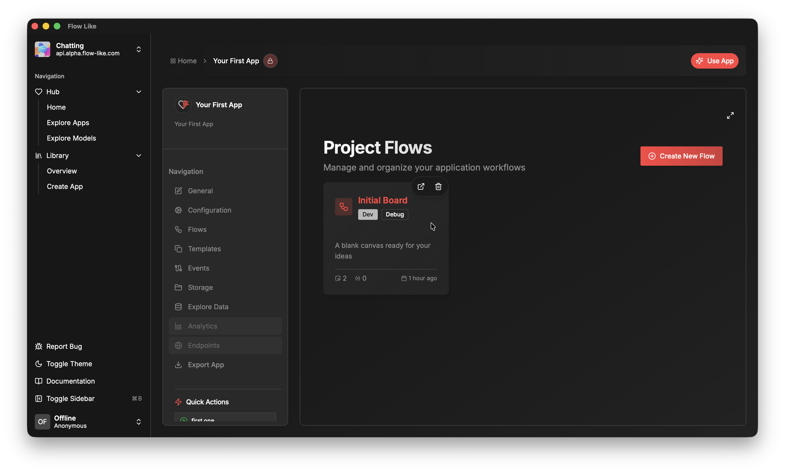

In the **Flows** section of your app you can create and manage your *workflows* as **Boards**.

Within an app you can create an arbitrary number of **Boards**. Each **Board** can contain an arbitrary number of **Flows**.

By default, we ship new apps with a first **Initial Board**. Once you click on it, you can start building your first **Flow** using our [Studio](/studio/overview/) builder environment. This is where the magic happens!

