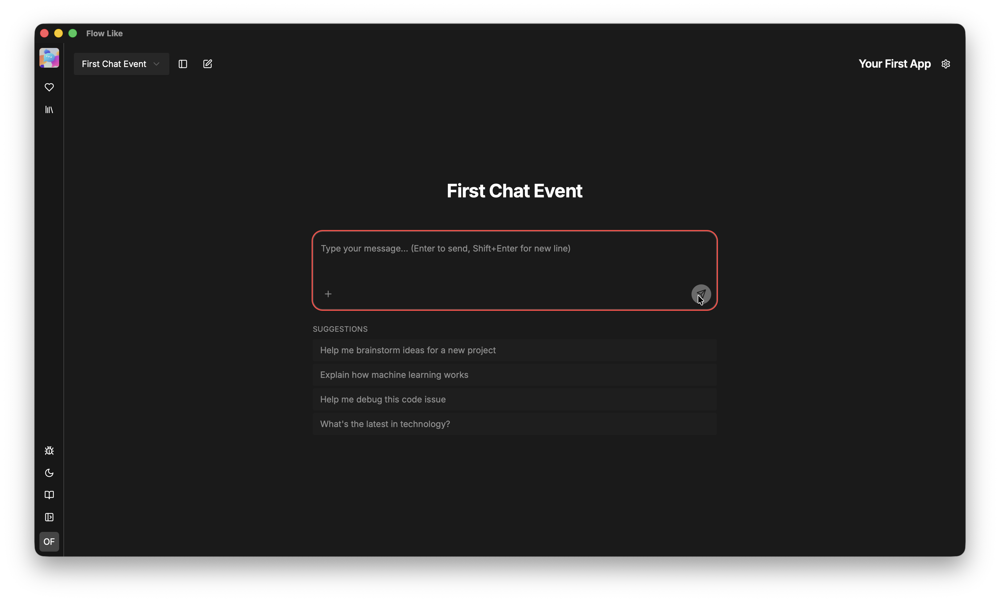

When you set up a **Chat Event** within your app (see [Events](/apps/events/)), Flow-Like automatically generates a **Chat UI** as part of your app.

Once this is set up, your app will automatically open in a chat interface.

You can create multiple chat interfaces by defining multiple **Chat Events** within your app.

