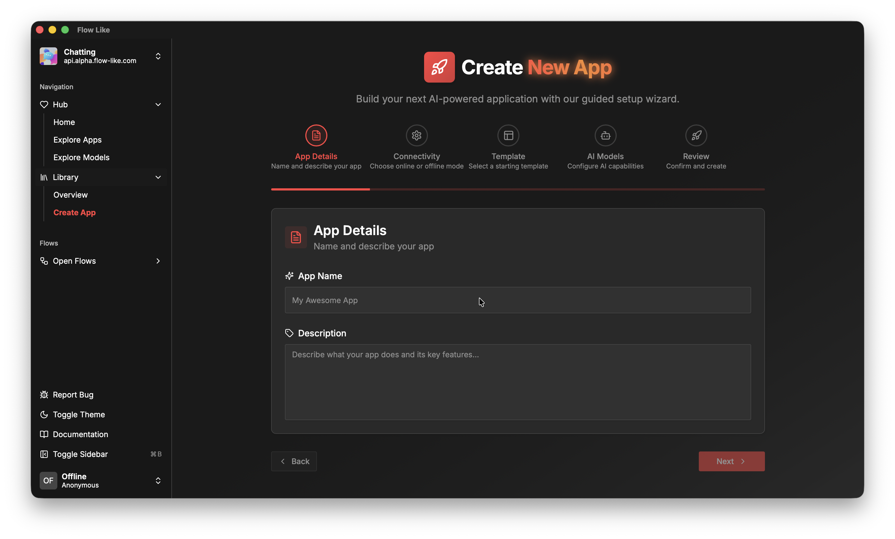

Head to the **Library** > **Create App** section of the desktop app to create your first app:

## App Details
Choose a name and description for your app. You can always change these details later.

## Connectivity
Here's the first decision you have to make: Do you want your app to run **locally** on your machine, or do you want it to be **cloud-enabled**, i.e. be an online app? For getting started, an offline / local app is perfectly fine. 

If you want to continue with online apps right away, please [login first with your FlowLike account](/start/login/). 

Further details on online apps and cloud connectivity can be found in the [Offline vs. Online](/apps/offline-online/) section.

## Template
You can build apps starting from [templates](/apps/templates/). If you open FlowLike for the first time, you might not see any templates yet. No worries, you can always add templates later. Let's start with a blank app for now.

## AI Models
Another decision that is fixed at app creation time is the selection of AI *embedding* models. You *can* select an *embedding* model if you *think* you might need them later. If you are not sure, selecting one of the recommended defaults is a good choice. If you are missing a specific embedding model, you can download it first in the [Model Catalog](/start/models/) section of the desktop app.

### What are Embedding Models?
[Embedding models](https://en.wikipedia.org/wiki/Embedding_(machine_learning)) are aspecific type of AI models that can represent complex data like texts, images, etc. as numerical vectors which we can use for search, recommendation systems, and more.

### Why Select Embedding Models Now?
Every embedding model has characteristics of its own and specific vector dimensions. Selecting embedding models at app creation time ensures that your app and the vectorized data within in remains compatible for you and your users.

### Does This Affect Chat Models Too?
No, you can always change and select different *chat models* in your Profile via the Model Catalog. In FlowLike, we have mechanisms in place to ensure that you can transition to new *chat models* seamlessly without breaking your existing workflows.

## Review
Everthing looks good? Then click **Create App**. Your new app is now listed in the **Library** > **Overview** section.