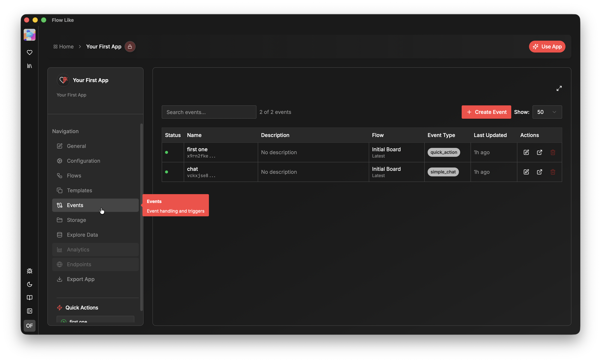
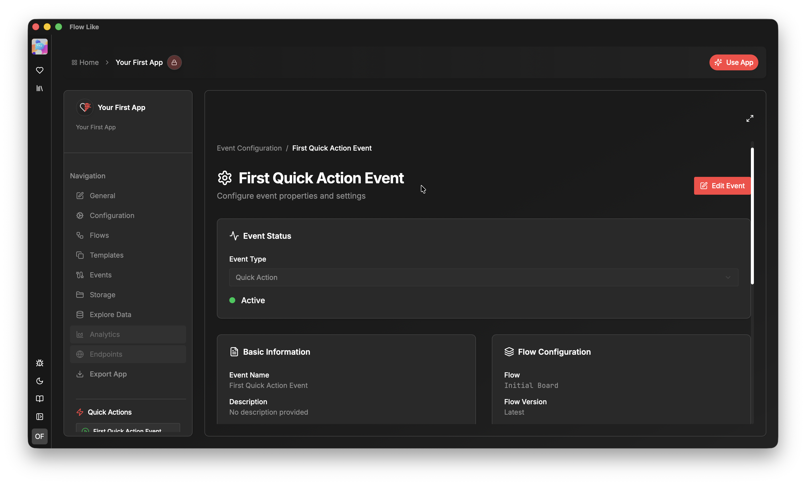

With **Events**, you can connect your **Flows** to the outside world.

Creating an **Event** requires at least one existing **Flow** in your app that includes an *event node*. You can create *Flows* in the **Flows** section of your app within [Boards](/apps/boards/).

Each **Event** targets a specific *event node* within a particular *Board* in your app. You can create multiple distinct *Events* that reference the same *event node*, and differentiate them by their payloads and configurations.

## Event Types

### Quick Action
A **Quick Action** is essentially a button that manually triggers a *Flow*. You can define additional variables to pass custom data to the triggered *Flow*.

### Chat Event
A **Chat Event** allows you to invoke a *Flow* through a chat interface ([automatically created when you set up such an event](/apps/chat-ui/)). A *Chat Event* passes the chat context (e.g., chat history) as payload to your *event node*. You can also configure additional payloads such as file attachments, tools, and default prompts.
