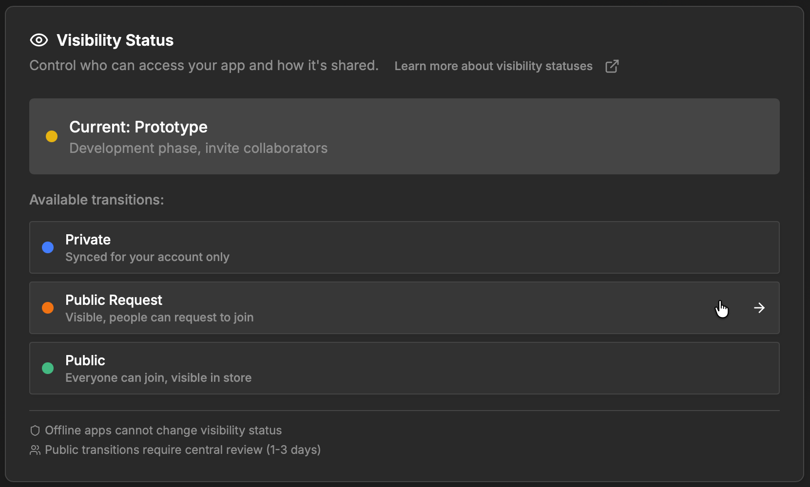
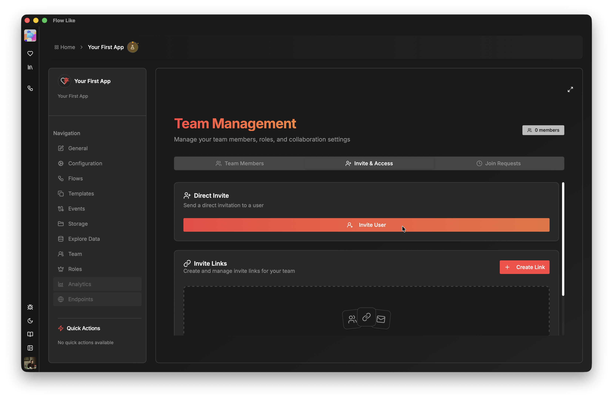
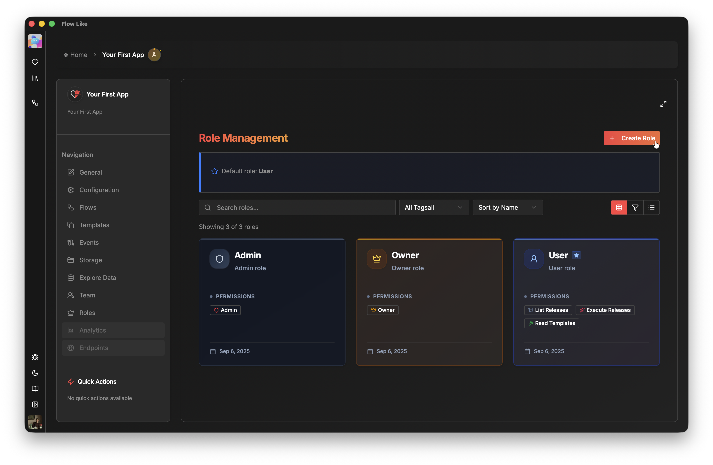

Sharing and visibility features require that you [log in with your Flow-Like account](/start/login/) and set your app to **online** (see [Offline vs. Online](/apps/offline-online/)).

## App Visibility

By default, an online app is set to **private**, meaning it is only accessible to you on any device where you are logged in. You can change this in the **General** tab of your app’s settings (**Visibility Status** section):

The minimum visibility level for sharing your app with others is **Prototype**. This allows you to share your app with other Flow-Like users.

As your app develops, you can increase its visibility to **Public Request** or **Public**, making it available in the **Flow-Like App Store**.

## Sharing Your App

Once your app has at least **Prototype** visibility, the **Team** tab will appear in your app’s settings.

In the **Team** tab, open the **Invite & Access** section to invite Flow-Like users directly or generate an invite link for your app:

## Rights and Roles

As the app **owner**, you can assign different **roles** to team members. Roles are managed in the **Roles** tab of your app’s settings. Each role can be given specific **permissions** for fine-grained access control:

