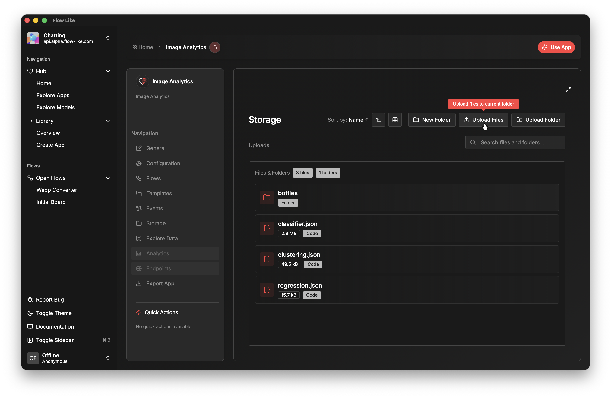
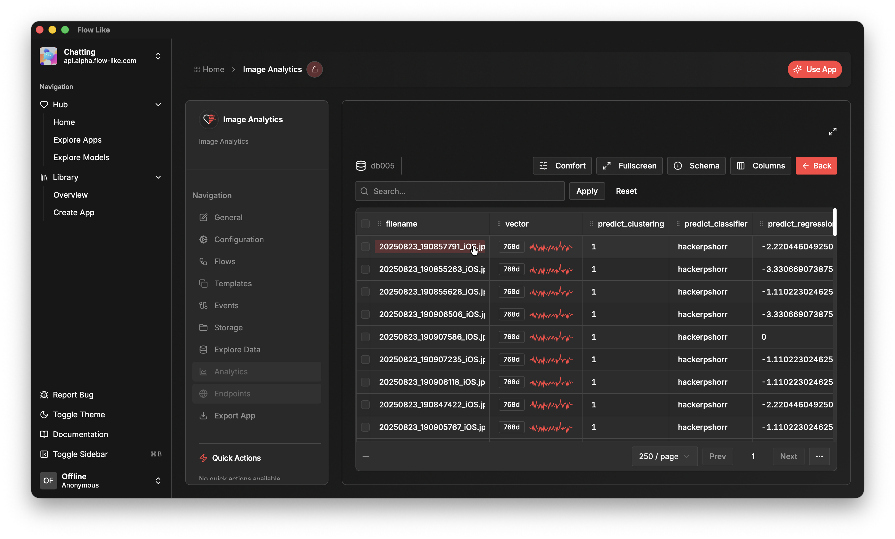

Every FlowLike app comes with dedicated **Storage** and **Databases**:
- In **Storage** you can upload and manage files and directories that you want to use in your flows. Simply choose from your local machine or drag & drop files directly.
- In **Explore Data** you can inspect all databases created and populated by your flows.

## Upload Directory
Here you can upload files and entire folders that should become part of your app. For online apps, the files are stored in the cloud and synchronized across all devices where you are logged in with your FlowLike account:

## Databases
You can create relational databases in your flows (for example to store processed data in a structured way). All databases created in your flows become visible here:

