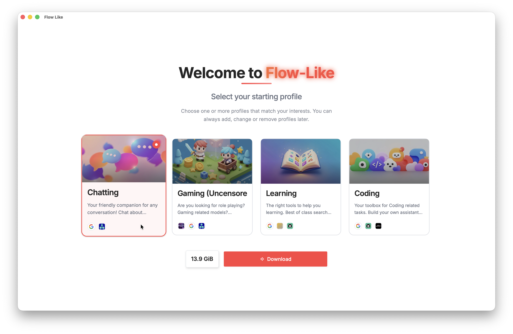
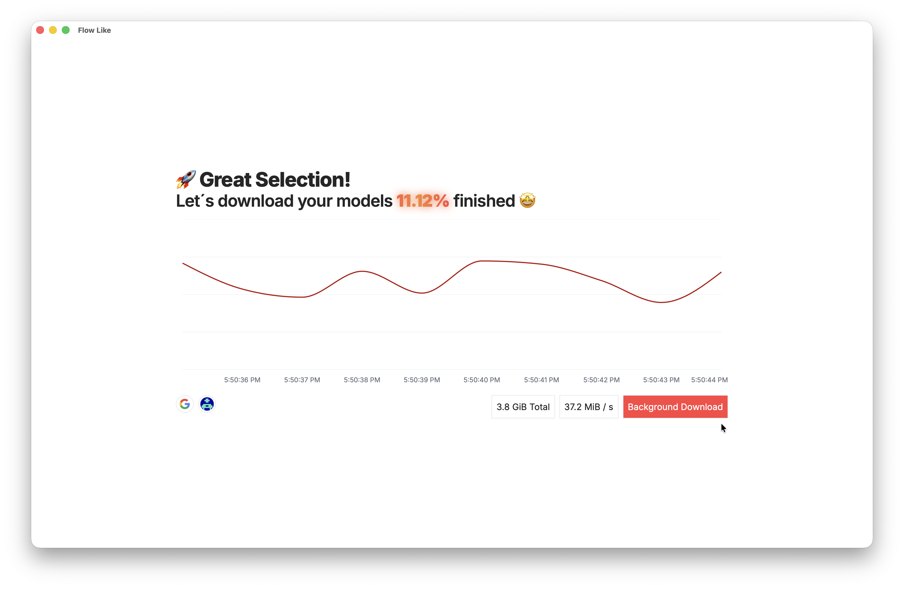
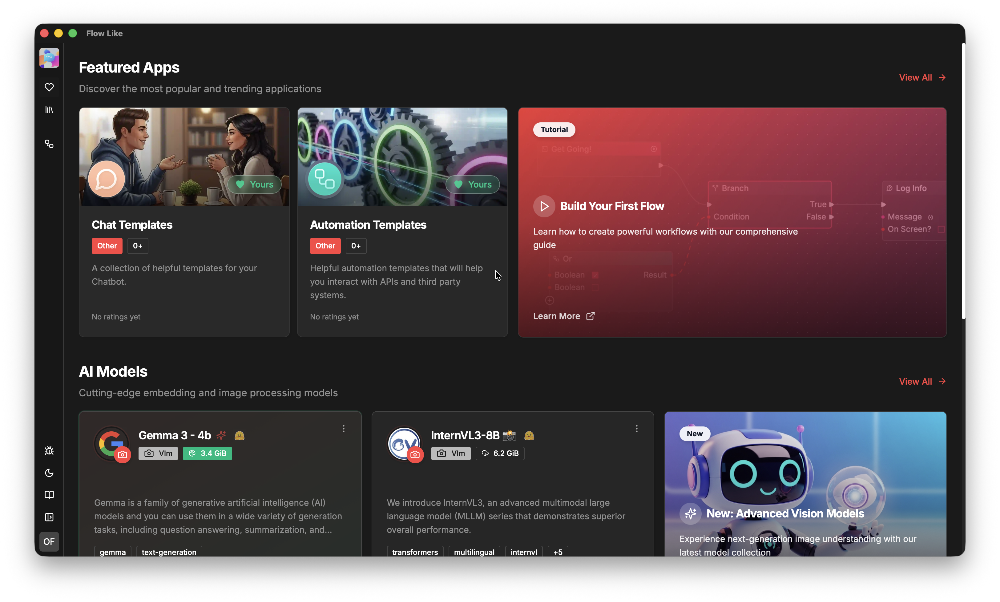

When first opening the desktop app of FlowLike you are prompted to select a [Profile](/start/profiles). A *Profile* bundles configurations and language models for you. To start, the **Chatting** is a good option:

In the next step, FlowLike downloads some first [language models](/start/models/) for you. You can either wait until done or head over to the next step and letting the download continue in the background:

Next, you can see the landing page of the desktop app. Awesome! You made it! 

*Welcome to FlowLike!* 🎉

There are some further aspects of the desktop app to explore next. Or directly jump ahead and [create your first app](/docs/apps/create/) to build a workflow.