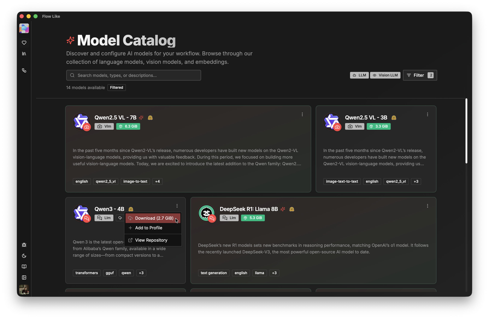
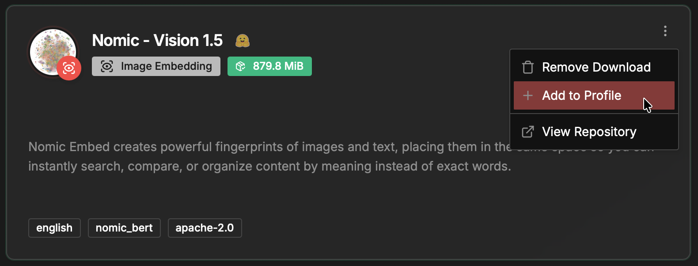

To enhance your automations with AI, we offer a rich catalog of language and vision models, as well as embeddings, in the **Explore Models** section of the desktop app:

You can download as many models as you like, subject to available disk space. Once downloaded, you can add a model to your [Profile](/start/profiles/) by clicking the three-dot button on the model card:

Once linked to your [Profile](/start/profiles/), you can access the model in the [Studio](/studio/overview/) environment when building and executing *Flows*.
