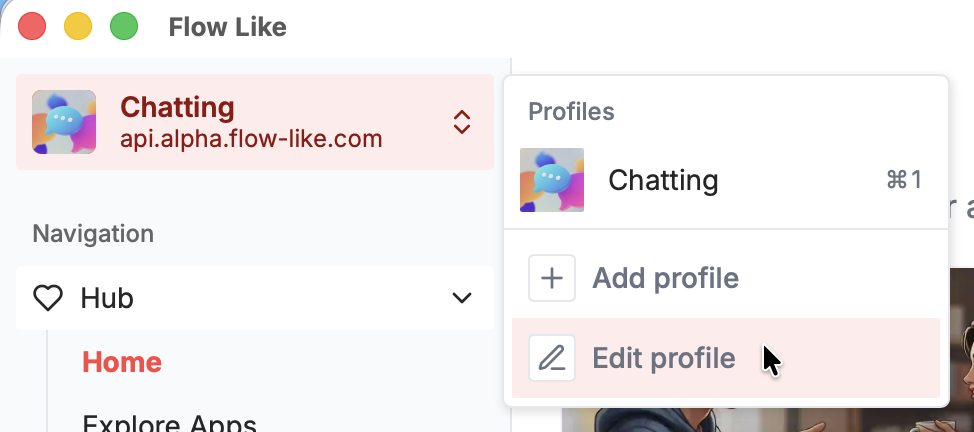
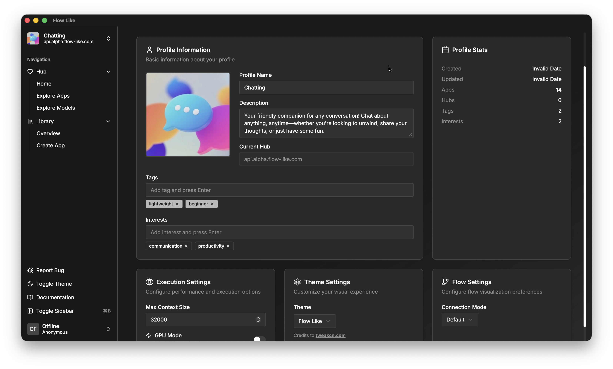

In the top left corner you find the *Profile Settings*, You can create multiple *Profiles* within your **Account** and *switch* between them:

In FlowLike, a **Profile** bundles configurations for language models, ui themes (*try Bubblegum!*) and some more settings: 

For example, you could create a profile for work and for private use. Or create a profile that contains only *Gemma* language models and another one that contains only reasoning models like *DeepSeek*.

