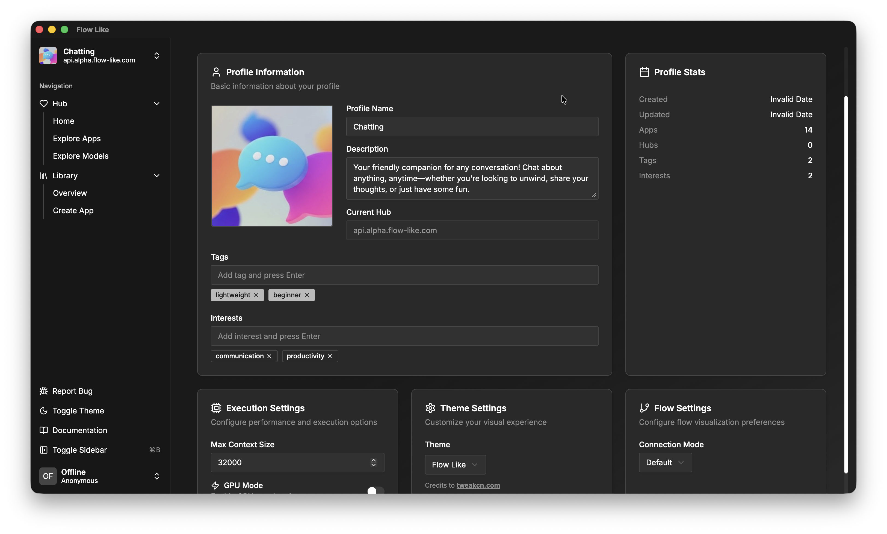

Select the Profile name in the upper-left navigation to switch Profiles, add a
Profile, or edit the active one. Profiles can be used without signing in;
signed-in Profiles can also carry account-backed settings.

A **Profile** groups preferences that should change together, including model
assignments, interests, theme, and FlowPilot model settings:

For example, keep separate work and personal Profiles, or create one Profile
for lightweight local models and another for provider-backed reasoning models.
Changing the Profile changes the active configuration; it does not move or
duplicate your Apps.

Each Profile can also have a personal Home layout. See
[Customize your Home](/start/home/) for arranging widgets and choosing between
personal, published, and bundled defaults.
