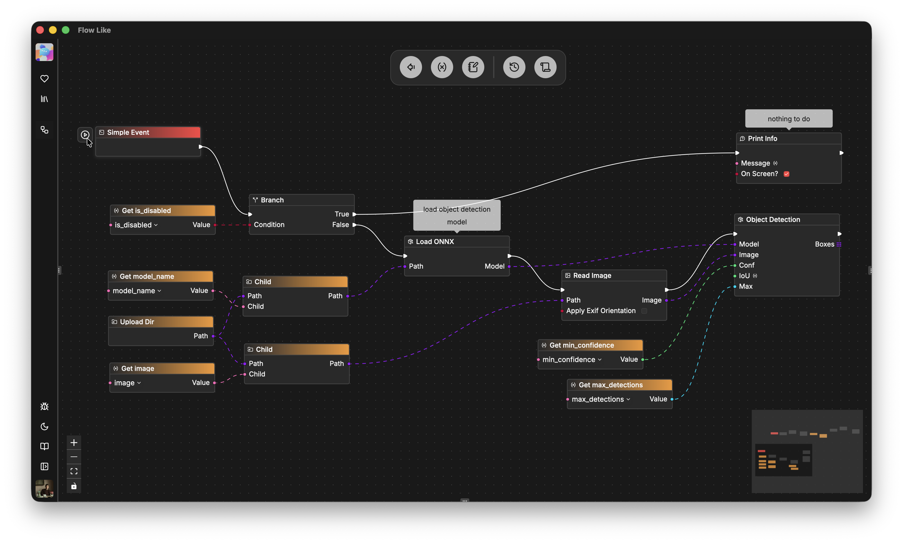
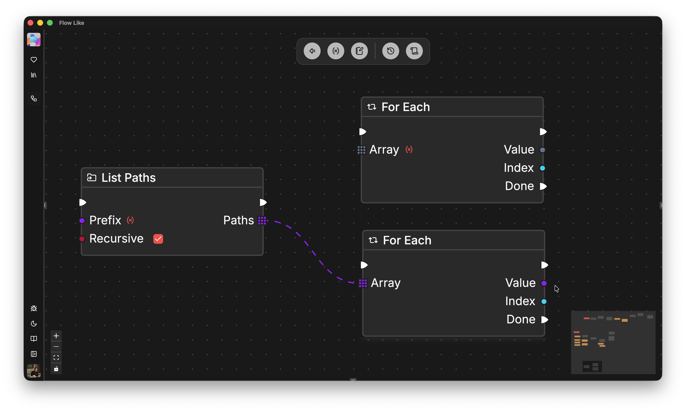
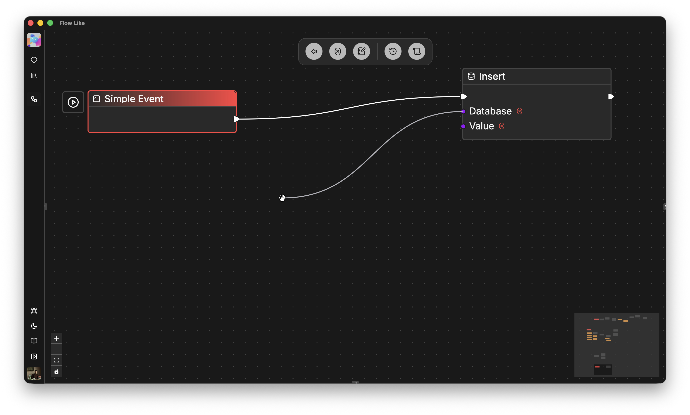
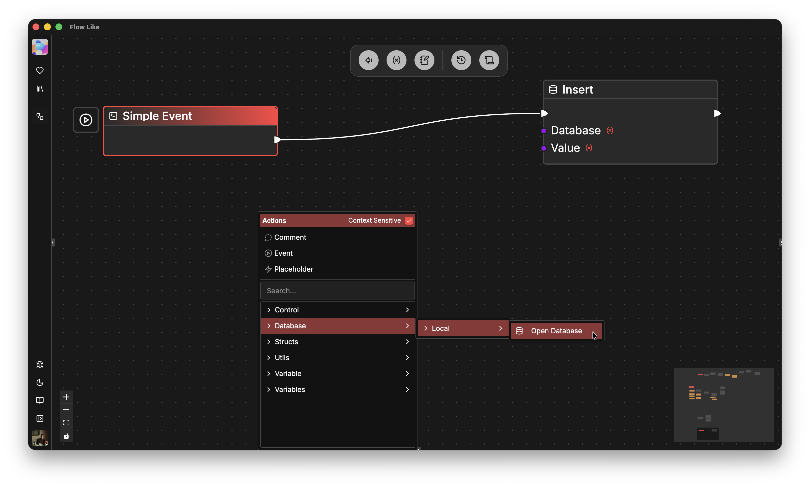

### Connection Types

There are two types of *wires* / *connections* between nodes:
- **Execution Wires** (*white*) represent execution flow throughout the graph, typically starting with an *event node*. Executions can branch at *Branch Nodes*, repeat in *Loop Nodes*, or split for *parallel* execution.
- **Data Wires** (*colored, dashed*) represent data transmission between nodes. The *color* of a data wire indicates the *data type* (see also [Variables and Types](/studio/variables/)).

All pins in Flow-Like Studio *enforce types*:
- You can only connect execution pins to other execution pins.
- You can only connect data pins to pins of the *same type* (aka *color*).

Some nodes additionally enforce a *schema* on complex types (structs, *purple*). For example, a *Path* output is only accepted by nodes that also have a *Path* input pin.

Some nodes come with *generic (unspecified) types* when selected from the node catalog. For example, the *For Node* allows looping over arrays of different types, but once an upstream data pin is connected, its type is *fixed* (e.g., a *For Node* for *Paths*):

### Auto-Suggestions Based on Types

Thanks to Flow-Like's strong typing mechanism, we can leverage the fact that only pins of the same type can be connected and suggest matching nodes.

Drag a pin (input or output) onto the open canvas to create a new node that is immediately connected to the current node:

Once you drop the dragged pin, the node catalog dialog opens and suggests only those nodes that can actually be connected to this pin:

Catalog filtering based on *types* can significantly speed up your flow creation process.
