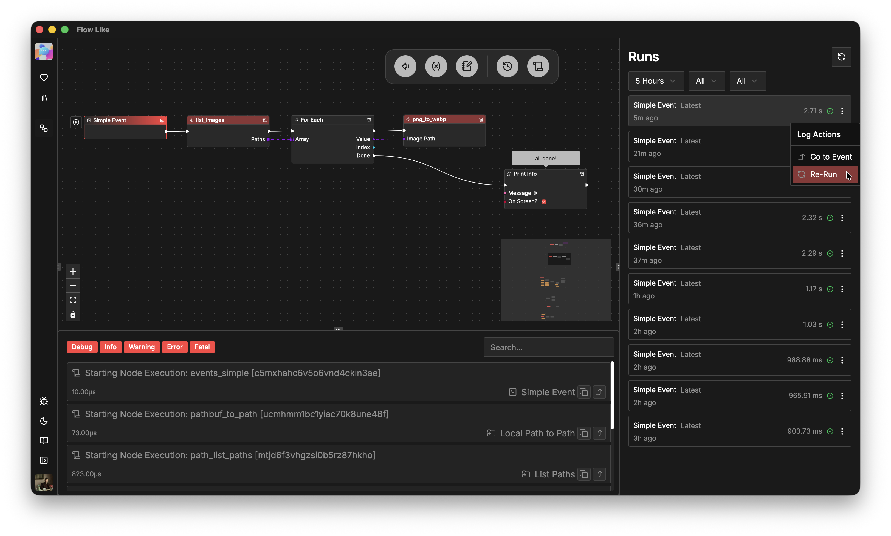

Every board offers you the possibility to inspect previous *runs* and for every *run* to read the logs generated by the executed nodes.

You can select historic runs and *re-run* them with the same payloads, e.g. to debug an error, observe total execution time, or to test a change you've made in your flow graph:

