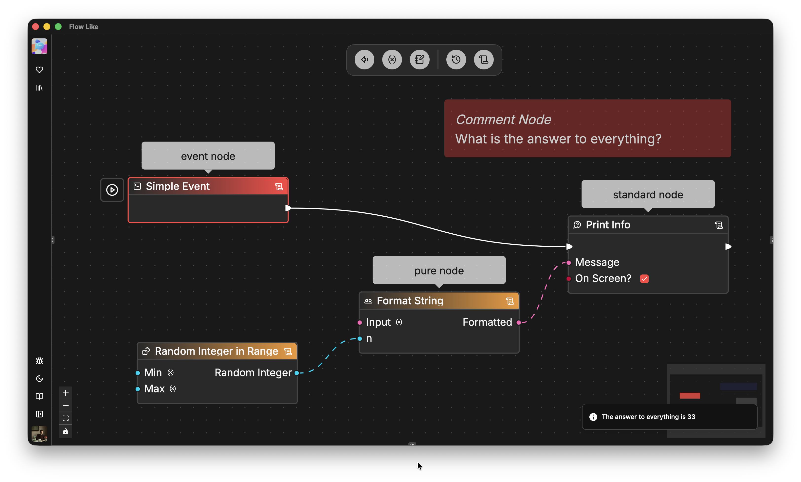

*Nodes* are the core building blocks of your *flows*. They can act as events, functions, variables or flow control operators.

Every node has a rectangular body that you can place anywhere on the canvas. Most nodes have input and output *pins* that allow you to *wire* them together ([how to connect nodes](/studio/connecting/)).

We distinguish between the following major node *types*:
- **Event Nodes** (*red*) mark the entry point into your flow execution and represent different triggering events. You can associate these nodes with [events on app level](/apps/events).
- **Standard Nodes** (*transparent*) typically have input and output *pins* for *execution* (white wires) plus pins for *data*. These nodes are only executed when an incoming execution pin is connected to a previously executed node in the flow.
- **Pure Nodes** (*yellow*) don't have execution pins or wires but just data pins. They are automatically executed when their data (outputs) are required by downstream nodes.
- **Comment Nodes** (*any color you like*) don't take part in flow executions and are for annotation purposes only. Editing comments opens a rich text editor that also supports embedded images.

You can browse all currently available *nodes* in the *Node Catalog*. Simply *right click* anywhere on the open canvas. You can browse nodes following the catalog hierarchy or searching for specific terms and keywords:

:::tip
The concept and anatomy of nodes in FlowLike is inspired by the [Unreal Engine Node Concept](https://dev.epicgames.com/documentation/en-us/unreal-engine/nodes-in-unreal-engine). You'll find many mutual analogies there which might actually help you understand common patterns, e.g. the [difference between standard (impure) and pure nodes](https://dev.epicgames.com/documentation/en-us/unreal-engine/functions-in-unreal-engine#purevsimpure).
:::