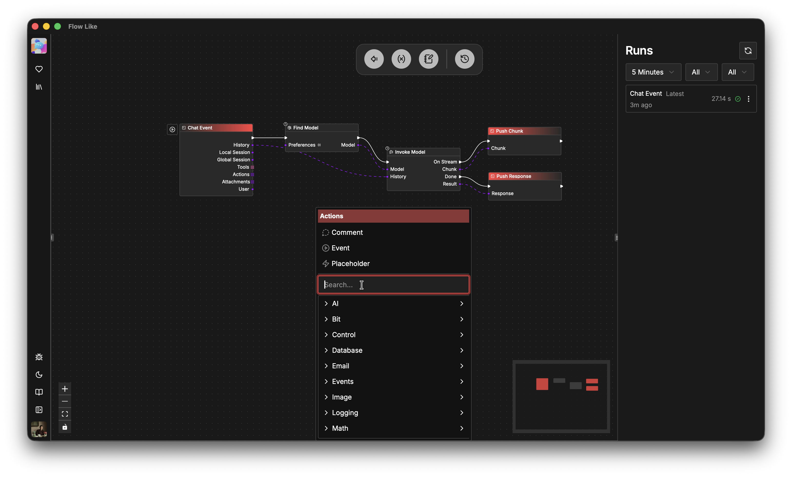

**Flow Like Studio** is the *No-Code* development environment where you build your *Flows* for automations.

Important components of the Stuido environemt are:
- [**Nodes**](/studio/nodes/) which you can select from the [**Node Catalog**](/nodes/overview/),
- [**Edges/Wires**](/studio/connecting/) for **Execution** and **Data** transmission between *nodes*,
- a **Canvas** where you can put your nodes and *build* your *flows*,
- [**Layers**](/studio/layers/) allowing you to collapse and define higher-order *nodes*,
- [**Variables**](/studio/variables/) that live on *Board* level to store and access information at runtime,
- [**Run History**](/studio/logging/) to inspect previous flow executions,
- [**Logs**](/studio/logging/) stored for every *run* for inspection and tracing.

A *Flow* represents a *process* and consists of one or more *Nodes*. Nodes are linked through *Edges* (or *Wires*) for *Execution* and *Data*.



Within *Apps*, Flows are managed in [Boards](/apps/boards/). You can put as many *Flows* within one *Board* as you like allowing you a fine-grained control on how to organize your projects:
```text
Flow Like Desktop
├── App1
│   ├── Storage and Databases
│   ├── Events
│   └── Boards
│       ├── Board1
│       │   ├── Flow1
│       │   └── Flow2
│       └── Board2
└── App2
```

*Flows* can access and modify [storage and databases](/apps/storage/) of their app. Likewise, [events](/apps/events) can be configured for all *flows* on app level.
