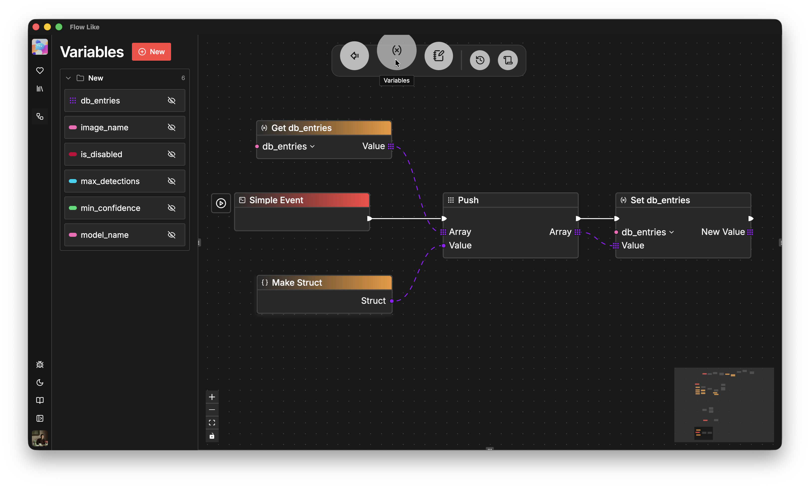
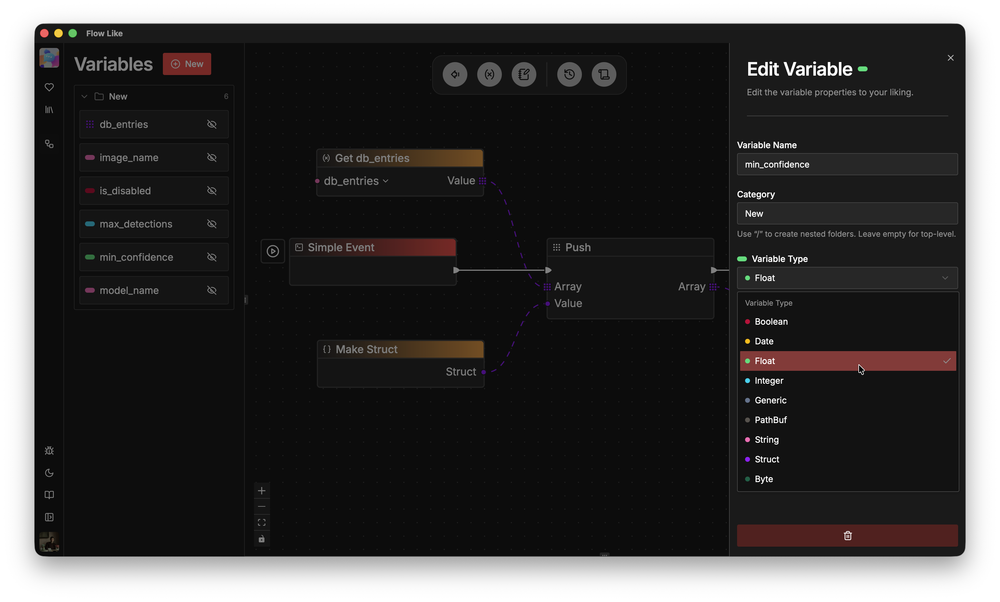
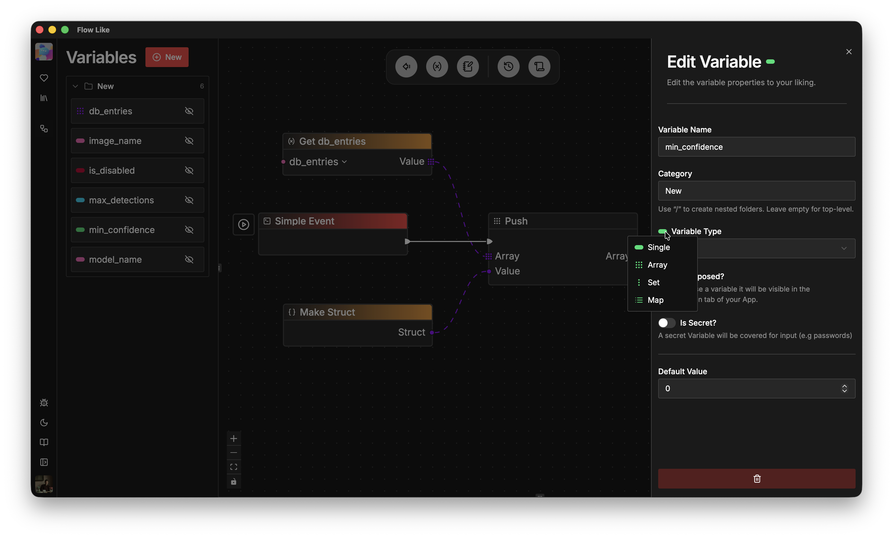

Variables act as shared, in-memory storage at the board level. Typical scenarios for using variables include:
- Configuring the name of a database and reusing it across multiple flows (e.g., for ingestion and retrieval).
- Recursively scraping a website for outgoing links and pushing each link into an array.
- During each *While Loop* iteration, evaluating whether a certain condition is still *true*. The condition is set somewhere downstream in the *While Loop* leaf branch.

All flows within a board can read and write variables through the *Get Variable* and *Set Variable* nodes:
- To *read* a variable, either search the node catalog for *Get variable_name* or drag and drop the variable from the variables menu onto the canvas.
- To *write* a variable, either search for *Set variable_name* or drag it from the variables menu.

To specify a variable *type*, open the variables menu, click the variable you want to configure, and select the type from the drop-down list:

To specify a variable *value* (*Single*, *Array*, *Set*, or *Map*), click the pill-shaped color indicator next to *Variable Types*:

