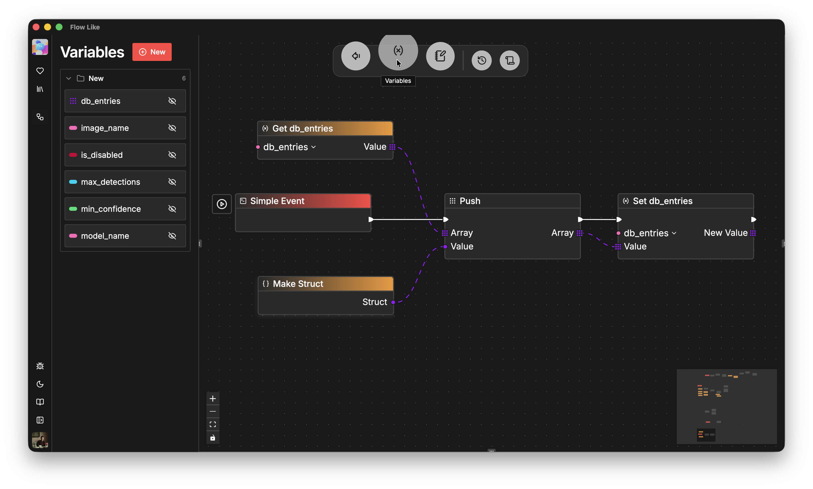
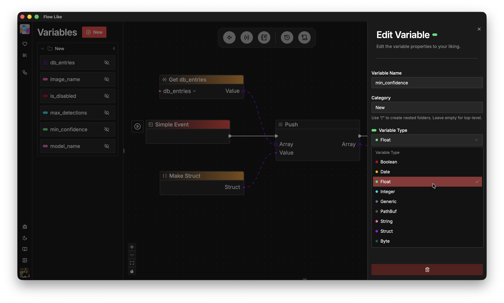
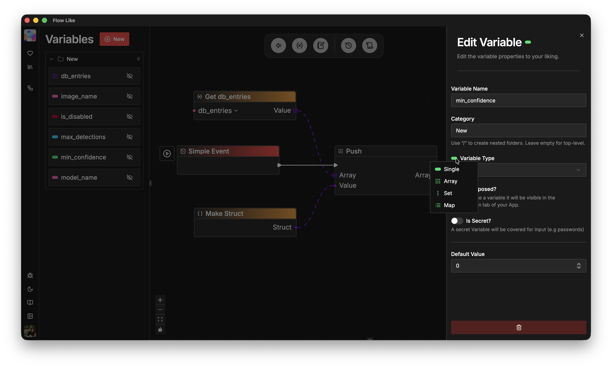

Variables are typed values shared by the nodes in one Flow. Each run receives
its own in-memory variable state.

Use a variable when several parts of a Flow need the same value or when a value
changes during execution—for example, an environment-specific table name, an
array accumulated in a loop, or a Boolean loop condition.

Nodes read and write variables through generated **Get _variable_** and
**Set _variable_** nodes:

- Search for the generated node in the Node Catalog.
- Or drag a variable from the variables panel onto the canvas and choose the
  read or write operation.

To set a variable's data type, open the variables panel, select the variable,
and choose its type:

Choose a value shape—**Single**, **Array**, **Set**, or **Map**—and provide a
default when the variable is neither exposed nor configured at runtime:

A **Date** variable holds an instant in UTC, not a calendar day. See
[Dates & Times](/reference/dates/) for its wire format, the inputs it parses,
the formatting placeholders, and how it is stored in tables.

A **Geometry** variable holds a location or shape as GeoJSON. Its pins use orange.
See [Geometry](/reference/geometry/) for subtypes, coordinate order, conversion
nodes, and spatial table queries.

## Variable Settings

### Exposed

An exposed variable appears in the App configuration and can accept a value
from a compatible Event or invocation. If no external value is supplied, the
Flow uses its configured default.

### Secret

A secret variable is masked in editors and treated as sensitive by Flow-Like's
authoring and diagnostic paths. Configure the actual value through the trusted
Runtime Variables screen instead of placing it in FlowScript or a normal
default.

### Runtime Configured

A runtime-configured value is not stored in the Flow definition. Configure it
per user and device in the App's
[Runtime Variables settings](/apps/runtime-variables/). Use this for:

- API keys, tokens, and passwords;
- local paths and device-specific settings;
- endpoints or identifiers that differ between environments;
- any value each runner should supply independently.

:::tip[Keeping Secrets Safe]
For a credential, enable both **Secret** and **Runtime Configured**. The value
is then held in local application storage and excluded from remote execution
payloads. A remote Flow that needs a credential must use the server-side
credential mechanism for that deployment.

See [Runtime Variables](/apps/runtime-variables/) for the storage and execution
rules.
:::
