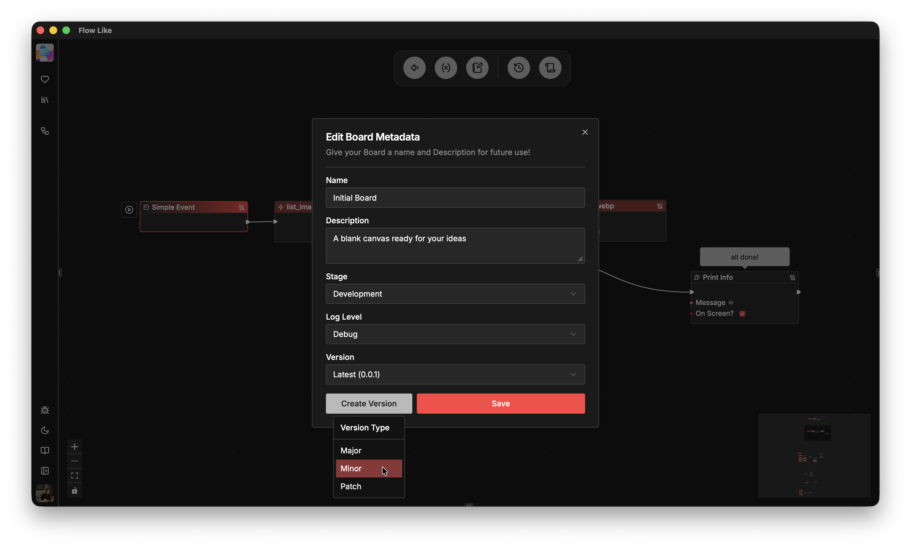

Flow boards come with built-in versioning (click on the *Board Settings* in the top navigation bar in FlowLike Studio):

Flow execution links to board versions (default is *latest*). You can configure [events](/apps/events/) to be linked to either the *latest* or a *specific* version of your board allowing you to safely transition between releases (e.g. for users of your app).