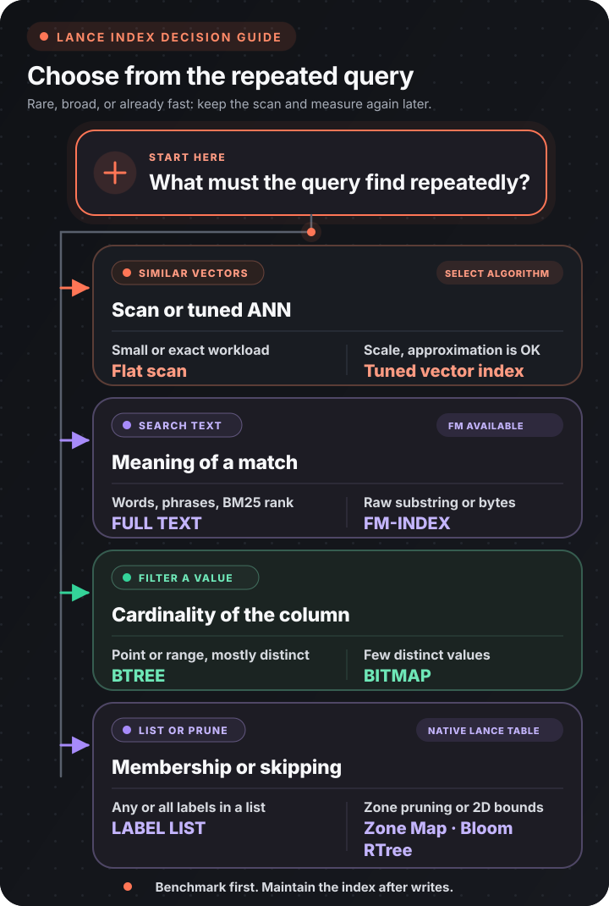

Choose an index from the query you need to accelerate. A useful index avoids reading most rows for a repeated, selective query. A rare query, a broad filter, or a small table may be faster and cheaper to scan.

Flow-Like's local database uses LanceDB over the Lance columnar format. A physical index stores an additional route from a search key to candidate row IDs. It consumes storage, takes time to build, and needs maintenance as new data arrives.

:::note[Version scope]
Flow-Like uses LanceDB 0.31.0 and Lance 8.0.0 with DataFusion 53 and Arrow 58. These versions keep LanceDB, SQL execution, and the external table providers on compatible interfaces. The `8.0.0` number identifies the Lance crate release, not an on-disk file-format version.

This upgrade stops at LanceDB 0.31 because later releases require DataFusion 54, while the published Delta Lake and Iceberg providers use DataFusion 53. The graph and SQL provider forks share that same runtime and retain their existing TLS and SQLite integrations.

The Build Index node, Data Studio, and HTTP API expose the same index algorithms. Existing workflows retain their saved selections, and `AUTO` and `VECTOR` continue to use cosine IVF-PQ for supported vector columns.
:::

An FM-index is a compressed index for finding an exact substring in raw strings or bytes. It does not tokenize text for relevance ranking.

## Choose from the query

The table is the text equivalent of the decision tree and includes the less common upstream choices.

| Repeated query | Start with | Availability in Flow-Like |
|----------------|------------|---------------------------|
| None, or the current scan is already fast | No index | Available |
| Exact nearest vectors on a manageable table | Flat vector scan | Available |
| Approximate nearest vectors at scale | A vector index chosen by recall, latency, memory, and storage tests | Seven explicit vector algorithms are available; all use cosine distance |
| Words, phrases, or BM25-ranked text | `FULL TEXT` | Available |
| Arbitrary substring filters through `contains` on string or binary data | `FM` | Available |
| Repeated `contains` or `LIKE` filters with a usable three-character literal | `NGRAM` | Native Lance tables |
| Point, range, `IN`, or null filters on mostly distinct scalar values | `BTREE` | Available |
| Point, range, `IN`, or null filters on a few distinct scalar values | `BITMAP`; fewer than about 1,000 unique values is the upstream starting heuristic | Available |
| Any or all membership tests inside a `List<T>` or `LargeList<T>` of primitive, low-cardinality values | `LABEL LIST` | Available |
| Skip zones using coarse minimum and maximum bounds | `ZONEMAP` | Native Lance tables |
| Skip zones using approximate membership with possible false positives | `BLOOMFILTER` | Native Lance tables |
| Prune two-dimensional bounding-box searches | `RTREE` | Native Lance tables |

Flow-Like builds `NGRAM`, `ZONEMAP`, `BLOOMFILTER`, and `RTREE` through the native Lance dataset API. They are available on native Lance tables, including managed tables backed by object storage. A remote LanceDB service connection returns an explicit unsupported error for these four types.

## What Build Index does today

The [Build Index](/nodes/data/database/optimization/index-local-db/) workflow node flushes buffered writes, then builds one index on one column. Choose the algorithm with its existing **Type** pin. Data Studio offers the same choices in **Build Index**. Distance, partition, quantization, and text-tokenizer parameters are not configurable through these controls. Each operation indexes one column.

| Selection | Current behavior |
|-----------|------------------|
| `BTREE` | Builds a B-tree index |
| `BITMAP` | Builds a bitmap index |
| `LABEL LIST` | Builds a label-list index |
| `FULL TEXT` | Builds a full-text inverted index |
| `FM` | Builds an index for raw substring searches |
| `NGRAM` | Indexes trigrams for substring and `LIKE` filters on native Lance tables |
| `ZONEMAP` | Stores per-zone minimum and maximum values to prune range filters on native Lance tables |
| `BLOOMFILTER` | Stores per-zone membership filters on native Lance tables |
| `RTREE` | Indexes two-dimensional geometry bounds on native Lance tables |
| `IVF_FLAT` | Searches IVF partitions with full vectors |
| `IVF_PQ` | Searches IVF partitions with product quantization |
| `IVF_SQ` | Searches IVF partitions with scalar quantization |
| `IVF_RQ` | Searches IVF partitions with RaBitQ quantization |
| `IVF_HNSW_FLAT` | Searches an HNSW graph in each IVF partition with full vectors |
| `IVF_HNSW_PQ` | Searches an HNSW graph in each IVF partition with product quantization |
| `IVF_HNSW_SQ` | Searches an HNSW graph in each IVF partition with scalar quantization |
| `VECTOR` | Builds an IVF-PQ index with cosine distance |
| `AUTO` | Builds the same cosine IVF-PQ index for a supported vector column; otherwise delegates to LanceDB `Auto`, which chooses B-tree for a supported scalar column |

`AUTO` does not inspect scalar cardinality. Choose `BITMAP` or `LABEL LIST` yourself when the query shape calls for one. On a vector column, `VECTOR` and `AUTO` take the same cosine IVF-PQ path.

All explicit vector algorithms use cosine distance to match Vector Search and Hybrid Search. Existing saved `VECTOR` and `AUTO` selections keep their previous meaning. Choosing an explicit algorithm replaces the index on that column when the build succeeds.

HTTP requests retain the original `FullText`, `BTree`, `Bitmap`, `LabelList`, and `Auto` names. New names are `Vector`, `Fm`, `NGram`, `ZoneMap`, `BloomFilter`, `RTree`, `IvfFlat`, `IvfPq`, `IvfSq`, `IvfRq`, `IvfHnswFlat`, `IvfHnswPq`, and `IvfHnswSq`. Workflow spellings such as `IVF_HNSW_SQ` and their lowercase equivalents are also accepted.

:::caution[Rebuild vector indexes created before this fix]
Flow-Like's Vector Search and Hybrid Search request cosine distance, and new `VECTOR` and vector `AUTO` indexes now use cosine as well. An existing index keeps the metric it was trained with. Run Build Index again on each affected vector column to replace a legacy L2 index, then compare recall with the flat-search baseline.
:::

## Choose a vector index

An approximate nearest-neighbor (ANN) index trades some recall for lower latency. LanceDB combines inverted-file (IVF) partitions with full vectors, scalar quantization (SQ), product quantization (PQ), RaBitQ quantization (RQ), or a hierarchical navigable small-world (HNSW) graph.

| Workload goal | Starting candidate | Practical consequence |
|---------------|--------------------|-----------------------|
| Exact results, or a table small enough to scan | No vector index | Reads every eligible vector and provides the comparison baseline |
| Highest recall without vector quantization | `IVF_HNSW_FLAT` | Keeps full vectors and uses more memory and storage |
| Strong recall and latency with lower memory use | `IVF_HNSW_SQ` | Quantizes each vector value and usually gives the best general starting point |
| Maximum compression or a filter-heavy workload | `IVF_RQ` | Compresses aggressively; verify recall on representative queries |
| Vectors with at most 256 dimensions, especially with filters | `IVF_PQ` | Compresses subvectors; tune partitions, probes, and refinement |

Flow-Like also exposes `IVF_FLAT`, `IVF_SQ`, and `IVF_HNSW_PQ`. An IVF index still searches selected partitions, so `IVF_FLAT` is approximate unless the query probes every partition. HNSW variants can show more latency variation under heavy filtering. Benchmark at least two plausible candidates.

An incremental update adds appended rows using the existing IVF partitions and, when applicable, the existing quantization model. It does not retrain IVF centroids or codebooks. Rebuild a vector index after major growth or a distribution shift, then measure recall again.

Build and query with the same distance metric. Record recall against the flat baseline, p50 and p95 latency, index size, build time, and write cost. The fastest result is useful only if its recall meets the product requirement.

## Additional scalar indexes

Choose `BTREE` for selective date or timestamp ranges when values are spread throughout a table. Choose `ZONEMAP` when rows are clustered by date, timestamp, or another ordered value, so the query can skip whole zones whose bounds do not overlap the requested range. Broad ranges may still favor a scan.

| Index | Use it for | Boundary |
|-------|------------|----------|
| `FM` | Exact raw substring filters through `contains` on string or binary data | Available in Build Index and Data Studio |
| `NGRAM` | Repeated text `contains` and `LIKE` predicates | Native Lance tables; ASCII-folded, lower-case trigrams; short patterns fall back to row checks |
| `ZONEMAP` | Cheap zone pruning when values cluster into useful min/max ranges | Native Lance tables |
| `BLOOMFILTER` | Cheap zone pruning for equality or membership tests | Native Lance tables; may return false positives, which the query verifies against rows |
| `RTREE` | Static two-dimensional bounding-box pruning for GeoArrow geometry | Native Lance tables; supported coordinate or WKB/WKT layouts |

GeoArrow describes geometry in Arrow arrays through field extension metadata. R-Tree supports separated `Float64` coordinate fields such as `Struct<x, y>`, the corresponding nested lists for lines and polygons, and GeoArrow WKB (Well-Known Binary) or WKT (Well-Known Text) columns. The field must carry its `geoarrow.*` extension name. For nullable geometries, mark coordinate children nullable as well.

Interleaved coordinates such as `FixedSizeList<xy: Float64, 2>` cannot currently be indexed after storage in Lance. Lance reconstructs the child name as `item`, which GeoArrow cannot interpret as a coordinate dimension. Use separated coordinates or WKB/WKT when importing geometry. The interface only offers R-Tree for supported layouts, and the backend validates the geometry schema before building the index.

The high-level LanceDB FM builder documents `contains` as its supported predicate. The lower-level Lance implementation can plan additional prefix, suffix, and regex operations. FM works on raw bytes and remaps `0x00` and `0xFF` to spaces, so it is unsuitable when those byte values must remain distinct.

Full-text search has a different purpose from FM and N-gram indexes. It tokenizes documents and supports term, phrase, and BM25-ranked retrieval. Use it when the meaning of a match is based on tokens rather than a raw substring.

## Build and maintain the index

:::caution[Version cleanup is explicit]
**Optimize and Update** now defaults **Keep Versions?** to true. In that mode it compacts fragments and updates indexes without pruning version history.

Disabling **Keep Versions?** runs the same maintenance first, then prunes versions older than seven days. Cleanup leaves unverified files untouched, which protects files that may belong to another process's in-progress operation. A tag that references an old version blocks pruning, and a pruned version cannot be checked out or restored. Flow-Like does not currently expose a different retention period.
:::

1. Capture the real filter or search and measure its unindexed latency.
2. Inspect the column type, cardinality, selectivity, and update pattern.
3. Pick the narrowest supported index from the decision table. Build it after the bulk load.
4. Use [List Indices](/nodes/data/database/meta/list-indices-db/) to record the generated index name, type, and column.
5. After substantial appends, run [Optimize and Update](/nodes/data/database/optimization/optimize-local-db/) with **Keep Versions?** enabled. Disable it only when the seven-day cleanup policy fits the database's retention requirements.
6. Repeat the same workload. Keep the index only when the latency gain justifies its build, write, and storage costs.

LanceDB queries scan rows that are newer than the indexed data and merge them with indexed results. The results remain complete, while latency can rise as uncovered rows accumulate. Upstream APIs expose index statistics for checking coverage. Flow-Like currently bundles index maintenance into **Optimize and Update**.

Use [Drop Index](/nodes/data/database/optimization/drop-index-db/) with the name returned by List Indices when an index is ineffective, obsolete, or built with the wrong vector metric.

## Upstream references

- [LanceDB indexing guide](https://docs.lancedb.com/indexing)
- [LanceDB scalar index choices](https://docs.lancedb.com/indexing/scalar-index)
- [LanceDB vector index choices](https://docs.lancedb.com/indexing/vector-index)
- [LanceDB reindexing and index coverage](https://docs.lancedb.com/indexing/reindexing)
- [Current Lance index-format specification](https://lance.org/format/index/)
- [Supported builders in LanceDB Rust 0.31.0](https://github.com/lancedb/lancedb/blob/v0.31.0/rust/lancedb/src/index.rs)
- [Lance 8.0.0 release](https://github.com/lance-format/lance/releases/tag/v8.0.0)
- [LanceDB 0.31.0 release](https://github.com/lancedb/lancedb/releases/tag/v0.31.0)
