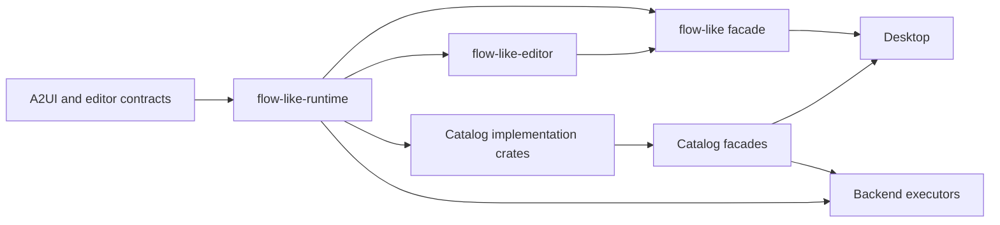

# Flow runtime and editor packages

Catalog implementations depend on `flow-like-runtime` so Cargo can compile them alongside
FlowScript editing and copilot services. Applications that use both surfaces can continue to
depend on `flow-like`; it reexports the same runtime types and editor APIs.

This simplified graph shows prerequisites pointing toward their consumers. Once
the runtime is available, the editor and catalog implementations can compile
concurrently. Backend executors use the runtime directly.



| Package | Owns | Depends on the runtime |
| --- | --- | --- |
| `flow-like-runtime` | Boards, nodes, execution, application state, model factories, and host services | It is the runtime |
| `flow-like-editor` | FlowScript lowering and reconciliation, copilot tools, and assistant services | Yes |
| `flow-like` | Compatibility reexports and feature forwarding | Yes |
| `flow-like-a2ui-schema` | A2UI schemas, state helpers, and protobuf conversions | No |
| `flow-like-editor-contracts` | Board editing commands, catalog metadata, and layer cache settings | No |
| `flow-like-core-contracts` | Shared copilot request and response types | No |

The editor calls public runtime APIs. The runtime has no dependency on the editor. A Board or
ExecutionContext obtained through the compatibility package is the same Rust type used by a
catalog implementation. Reexports also preserve the existing protobuf conversions.

Workspace catalog manifests use the canonical dependency name `flow-like-runtime` with
`workspace = true`. The root `[workspace.dependencies]` table owns its path, and consumers
select the features they need. Crates that retain `use flow_like::...` imports declare
`extern crate flow_like_runtime as flow_like;` at their Rust crate root. This source alias
keeps existing imports working. Depending directly on the runtime removes the editor from
the catalog dependency graph. Consumers needing `flow::ast`, `flow::copilot`, or
`a2ui::copilot` should use the compatibility package or depend on the editor explicitly.

The compatibility package forwards its existing features to the runtime. `flow-metadata`
selects the metadata surface, while `flow` and `flow-runtime` enable execution with database
log persistence. Its default remains `full`. Consumers using the editor directly enable its
`flow-runtime` feature when they need database-backed assistant memory and execution tools.
Database and local model backends remain runtime dependencies when enabled.

The shared core crates produce Rust libraries (`rlib`). Tauri's application
wrapper retains the `cdylib` and `staticlib` outputs required by its mobile
projects, so core dependencies no longer generate those extra native artifacts.

Runtime unit tests live in `runtime/src`; editor unit tests live in `editor/src`. Integration
tests and examples stay in this package and exercise the public compatibility API. Run focused
checks from the repository root:

```sh
cargo check -p flow-like-runtime --no-default-features --features flow-metadata
cargo test -p flow-like-editor --lib
cargo test -p flow-like-a2ui-schema -p flow-like-editor-contracts --lib
cargo test -p flow-like --no-default-features --features flow-metadata --test compiled_board_roundtrip
```
